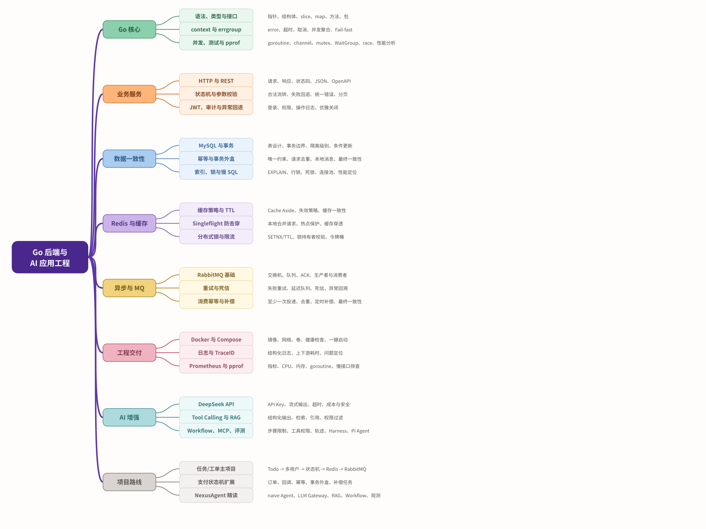

# Go 后端与 AI 应用工程学习路线

> 目标：以 Go 为主线，具备企业级后端交付能力，同时能够把大模型、RAG、Agent 和 MCP 接入真实业务。
>
> 适用背景：已有 Node.js/Web3 后端经验，当前使用 Java/RuoYi，正在补 Go 后端能力。

## 学习路线思维导图

先看主干，再阅读后面的详细阶段。每个主分支代表一类长期能力，不要求一次性全部学完。



## 1. 总体定位

不要把目标定成“学会所有 AI 工具”，而要形成下面的能力组合：

```text
Go 企业级后端能力
+ 数据库、缓存、消息队列和部署能力
+ AI 应用接入能力
+ 能使用 AI 编程工具完成可靠交付
```

推荐时间分配：

- Go 后端基础与工程：70%
- AI 应用工程：25%
- Pi Agent、Harness 等具体工具：5%

核心原则：先学稳定的概念和协议，再学习具体框架；先做完整项目，再整理八股。

### 目标岗位画像

参考一份获得上海 Go 后端 15k 外包机会的两年经验简历，企业更看重的不是“会多少框架”，而是下面这条能力链：

```text
复杂业务状态流转
-> MySQL 事务与索引
-> Redis 缓存与幂等
-> RabbitMQ 异步解耦与重试
-> TraceID / pprof / 日志排障
-> Docker 交付
-> AI 作为业务能力增强
```

后续项目和简历描述都应使用“业务问题 -> 设计方案 -> 异常处理 -> 验证证据”的结构。不要编造吞吐量、响应时间或线上指标；只写能够解释来源的数据。

## 2. 练习项目与参考源码

### 你当前的主练习项目

```text
本地地址：D:\demo\awesomeProject
当前阶段：内存版 Todo API
下一目标：接入 MySQL，演进为企业任务/工单系统
```

这个项目用于从零训练 Go 后端的核心能力。后续会在同一个项目里逐步加入 MySQL、Repository、JWT、Redis、RabbitMQ、Docker、监控和 AI 能力。

### 后期 AI 参考源码：NexusAgent

- 仓库地址：[chengpeng-cp/nexus-agent](https://github.com/chengpeng-cp/nexus-agent)
- 定位：Go 智能体平台教学源码，不是当前阶段需要直接复刻的练习项目。
- 适合开始精读的时机：完成 MySQL、Redis、Docker、消息队列和基础监控之后。

建议阅读顺序：

```text
agent/naive      -> 最小 ReAct 与 Tool Calling 原理
llm/gateway      -> 重试、熔断、fallback、并发控制
rag/engine       -> 分块、混合检索、RRF、Rerank
workflow/mcp     -> 受控 Workflow 与 MCP
observability    -> 追踪、指标、日志
```

它的技术栈较重（Hertz、PostgreSQL、Redis、Milvus、MinIO、React、OTel 等），所以作为后期案例学习；不替代你的 `awesomeProject` 主线训练。

## 3. 学习优先级

不要同时追所有技术。按就业收益分三层：

| 优先级 | 内容 | 学习要求 |
| --- | --- | --- |
| P0 必须掌握 | Go、HTTP、状态机、MySQL、事务、Redis、幂等、测试、Linux、Docker | 能独立实现、测试和部署 |
| P1 重点掌握 | JWT、RabbitMQ、事务外盒、日志、TraceID、监控、pprof、RAG、Tool Calling | 能在项目中落地并解释取舍 |
| P2 了解即可 | go-zero、gRPC、Etcd、MongoDB、Elasticsearch、Kubernetes 高级、MCP、Harness、Pi Agent | 了解原理，有需要再深入 |

当前阶段不要同时学习 Kafka、RocketMQ 和 RabbitMQ。第一种消息队列选择 RabbitMQ；数据库先以 MySQL 为主，PostgreSQL/pgvector 放到 AI 知识库阶段。

## 4. 阶段路线总览

| 阶段 | 主题 | 主要产出与毕业标准 |
| --- | --- | --- |
| 0 | 基础盘点 | 能运行项目、看懂错误、使用 Git/Linux 调试 |
| 1 | Go 核心 | 能写可测试、并发安全的 Go 服务 |
| 2 | 业务服务 | 能交付鉴权、校验、状态机、分页和错误处理 |
| 3 | 数据一致性 | 能设计表、写事务、分析索引、实现幂等并接入缓存 |
| 4 | 工程交付 | 能用 Docker 部署，并通过日志、TraceID 和指标排障 |
| 5 | 消息与分布式 | 能处理 RabbitMQ、重试、死信、事务外盒和最终一致性 |
| 6 | AI 应用 | 能完成模型 API、Tool Calling 和 RAG |
| 7 | Agent/MCP | 能做受控 Workflow，理解 MCP 和评测 |
| 8 | 求职准备 | 能讲清项目、做系统设计和回答核心八股 |

## 5. 阶段 0：基础盘点

### 学习内容

- Go 安装、`go mod`、`go fmt`、`go test`
- GoLand 调试
- Git 基础
- Linux 常用命令
- HTTP、JSON、状态码和 REST 基础
- TCP/IP、DNS、TLS、端口和连接的基本概念
- 进程、线程、内存、文件和 IO 的基本概念

### 验收标准

- 能创建模块、添加依赖并运行项目
- 能看懂编译错误和测试失败信息
- 能使用 PowerShell/Linux 命令调用接口
- 能解释一次 HTTP 请求从客户端到服务端的大致路径

## 6. 阶段 1：Go 核心

### 必学内容

- 变量、指针、结构体、方法和接口
- slice、map、数组和 JSON tag
- 包、模块、导出与未导出
- error、`defer`、`panic`、错误包装
- `context.Context`
- goroutine、channel、mutex、`sync.WaitGroup`
- 单元测试、HTTP 测试和 `go test -race`
- benchmark、`pprof` 和基本性能分析

### 项目产出

完成一个内存版 Todo/任务服务，包含：

- 创建、查询和更新
- Service 分层
- 参数校验
- 统一错误响应
- 单元测试和 HTTP 测试
- 并发安全

## 7. 阶段 2：企业级 Web 服务

### 推荐技术

- Gin 或 Chi
- REST API
- middleware
- JWT
- OpenAPI/Swagger

### 必须掌握

- Handler、Service、Repository 分层
- 请求参数校验
- 统一响应和错误码
- 分页、排序和过滤
- 登录、鉴权和 RBAC
- 超时、取消和优雅关闭
- 幂等接口设计
- 状态机：合法流转、非法状态拦截、失败回退和操作审计

### 项目升级

将 Todo 服务升级为多用户任务系统：

```text
用户注册/登录
-> JWT 鉴权
-> 用户只能访问自己的任务
-> 任务状态机与状态变更日志
-> 分页查询
-> Swagger 文档
-> 统一错误处理
```

## 8. 阶段 3：数据库与缓存

### MySQL（当前主线）

- 表结构设计
- 主键、唯一索引和普通索引
- JOIN、聚合和分页
- 事务和隔离级别
- 行锁与死锁
- `EXPLAIN` 和慢查询
- GORM 与原生 SQL 的取舍
- 条件更新、唯一约束和并发写入

### Redis

- String、Hash、List、Set、ZSet
- TTL 和缓存读写
- 缓存穿透、击穿、雪崩
- Singleflight 与本地缓存
- 分布式锁
- 限流
- 缓存和数据库一致性

### 项目产出

- 使用 MySQL 持久化 Todo
- 增加 Repository 层
- 增加事务测试
- 为查询增加合理索引
- 对热点查询增加 Redis 缓存

## 9. 阶段 4：消息队列与工程化

### 消息队列

第一种消息队列选择 RabbitMQ，掌握后再阅读 Kafka/RocketMQ 的模型差异：

- 生产者和消费者
- ACK 和重试
- 重复消费
- 顺序消息
- 死信队列
- 消费幂等
- 最终一致性
- 事务外盒（业务数据与本地消息同事务落库）

### 工程化

- Docker 和 Docker Compose
- 配置文件与环境变量
- 结构化日志
- Prometheus 指标
- OpenTelemetry 基础
- 健康检查和就绪检查
- CI 自动测试
- Nginx 和基础部署
- Kubernetes 基础概念

### 故障排查能力

能够回答并实践：

- 接口突然变慢如何定位
- 数据库慢查询如何定位
- CPU、内存和 goroutine 暴涨如何排查
- Redis 不可用时服务如何降级
- 消息重复消费如何处理

## 10. 阶段 5：分布式基础

- 超时、重试和退避
- 限流、熔断和降级
- 幂等和去重
- 分布式锁
- 分布式事务的基本思路
- 事务外盒、定时补偿和失败回溯
- 最终一致性
- CAP 和 BASE 的基本理解
- 服务拆分的边界

这一阶段重点不是背概念，而是能在项目中解释为什么这样设计。

## 11. 阶段 6：AI 应用工程

正确顺序：

```text
模型 API
-> Structured Output
-> Tool Calling
-> RAG
-> Agent Workflow
-> MCP
-> 评测与 Harness
```

### 模型 API

- API Key 和环境变量
- 超时、重试和限流
- 流式输出
- Token、上下文窗口和成本
- 模型供应商切换

### Structured Output

让模型返回可以被后端校验的结构化数据，而不是直接相信自然语言。

### Tool Calling

让模型调用后端定义的函数，例如查询订单、查询任务、创建工单。

### RAG/知识库

```text
文档上传
-> 解析
-> 分块
-> Embedding
-> 向量数据库
-> 相似度检索
-> 组装上下文
-> 模型回答
-> 返回引用
```

需要掌握：Embedding、Chunking、Top-K、Rerank、引用、权限和评测。

推荐起步组合：Go + PostgreSQL/pgvector 或 Qdrant + DeepSeek/OpenAI-compatible API。

## 12. 阶段 7：Agent、MCP 和 Harness

### Agent

优先学习 Workflow，再学习自主 Agent：

- 明确状态
- 有限工具
- 最大执行步数
- 超时和取消
- 权限控制
- 操作日志
- 失败重试

### MCP

MCP 主要解决模型以统一协议发现和调用外部工具、资源。可以把自己的 Todo、订单或知识库封装成 MCP Server。

### Harness

Harness 关注 Agent 的运行、编排和评测：

- 记录模型调用轨迹
- 记录工具调用
- 控制最大步骤数和成本
- 自动回归测试
- 评估回答正确性和工具选择
- 防止危险操作

### Pi Agent

Pi Agent 可以作为日常开发工具学习使用：

- 配置模型和 API Key
- 理解 Agent 如何读取文件、执行命令和修改代码
- 检查权限和工具调用
- 让它执行测试并审查结果

不需要优先研究源码，也不应该把“会用某个 Agent 工具”当成核心竞争力。

## 13. 项目路线：一主两辅

### 主项目：企业任务/工单系统

这是传统后端能力的主要证明项目：

```text
Go + Gin + MySQL + Redis + JWT + RabbitMQ + Docker + 测试 + 监控
```

演进顺序：Todo -> 多用户任务 -> 工单状态机 -> 支付/回调模拟 -> 消息通知与补偿。

### AI 子项目：企业知识库

```text
Go + 文件上传 + 文档解析 + Embedding + 向量数据库
+ RAG + 权限 + 流式回答 + 引用 + 评测
```

### Agent 功能：在知识库中加入业务工具

```text
Go + DeepSeek API + Tool Calling + Workflow + MCP
+ 权限 + 审计日志 + Harness + 成本和延迟监控
```

不要一开始单独开发复杂的 Agent 平台，先在知识库中实现查询工单、创建工单等有限工具。

## 14. 建议时间安排

按每周 10 到 15 小时投入估算：

| 时间 | 重点 | 阶段产出 |
| --- | --- | --- |
| 第 1 个月 | Go、HTTP、测试、并发、Linux | 并发安全的 Todo API |
| 第 2 个月 | MySQL、事务、索引、Repository、JWT | 多用户任务系统 |
| 第 3 个月 | Redis、Docker、日志、健康检查 | 可一键启动的服务 |
| 第 4 个月 | RabbitMQ、事务外盒、幂等、监控、pprof、故障排查 | 异步通知和排障记录 |
| 第 5 个月 | DeepSeek API、结构化输出、Tool Calling、RAG | AI 企业知识库 |
| 第 6 个月 | Workflow、MCP、Harness、项目包装和面试 | 可展示的完整项目 |

每天建议：

- 20 分钟：学习概念
- 60 分钟：项目实现
- 20 分钟：测试和验证
- 20 分钟：总结成面试表达

## 15. 暂时不学习清单

下面内容不是没价值，而是当前投入产出比不高：

- Kubernetes 高级调度和源码
- Service Mesh
- 同时学习多个消息队列
- 向量数据库底层实现
- 模型微调和训练
- DSPy、PydanticAI 等框架源码
- 多 Agent 复杂编排
- 自建大模型推理服务
- 各种 AI 编程工具的源码

## 16. AI 辅助开发规范

AI 可以帮助你：

- 生成代码初稿
- 解释错误
- 补测试
- 做代码审查
- 比较设计方案
- 生成文档

但每次使用 AI 后，你都要确认：

- 我能解释这段代码的职责吗？
- 我知道它修改了哪些共享数据吗？
- 我知道失败时会发生什么吗？
- 我能写出测试吗？
- 我能说明为什么选择这个方案吗？

## 17. 面试准备

八股不需要现在单独大量背。每完成一个模块，整理对应问题：

- 学 mutex 后：mutex、channel、atomic 的区别
- 学 MySQL 后：事务、索引、隔离级别
- 学 Redis 后：缓存击穿、雪崩和一致性
- 学 RabbitMQ 后：重复消费、重试、死信和消息可靠性
- 学 RAG 后：切片、召回、Rerank 和幻觉
- 学 Agent 后：工具权限、循环控制和评测

最终要能完整讲清楚一个项目：需求、架构、数据流、异常、测试、部署和优化。

## 18. 第一阶段行动清单

- [x] 完成内存版 Todo 的 Service、HTTP 和并发测试
- [x] 使用 Docker Compose 启动 MySQL，并创建 `todos` 表
- [ ] 将 Todo 接入 MySQL
- [ ] 增加 Repository 层、事务和状态变更日志
- [ ] 增加用户登录与 JWT
- [ ] 将 Go 应用纳入 Docker Compose 启动
- [ ] 增加 Redis 缓存
- [ ] 增加结构化日志和健康检查
- [ ] 写一份项目架构说明
